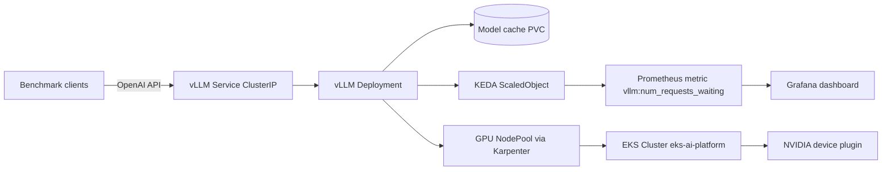

# Architecture

```mermaid
flowchart LR
  U[Benchmark clients] -->|OpenAI API| S[vLLM Service ClusterIP]
  S --> D[vLLM Deployment]
  D --> C[(Model cache PVC)]
  D --> K[KEDA ScaledObject]
  K --> P[Prometheus metric vllm:num_requests_waiting]
  D --> G[GPU NodePool via Karpenter]
  G --> E[EKS Cluster eks-ai-platform]
  E --> N[NVIDIA device plugin]
  P --> F[Grafana dashboard]
```
